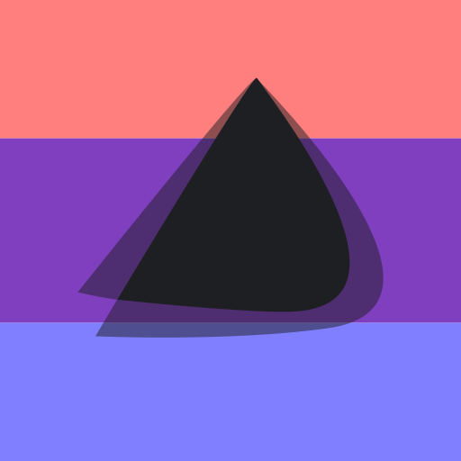

# Linux Icons

This is a collection of Icons for some of the main Linux Discord servers, although they can also have applications elsewhere. The main goal behind this is to have a central place where consistient icons and assets can be stored for anyone to use. This inistally started as just for Pride Month, but has plans to provide a simple, consistint logo design for regular use as well as special occiasions.

## Current Provided Icons

Arch
Endeavour OS
Fedora
Gentoo
Manjaro
Mint
NixOS
OpenSUSE
Pop!_OS
ReactOS
System76 (Parent company of Pop!_OS)
Void Linux

## Standards

In oredr to keep everything consistient, there are standards to be put into place, incase someone wishes to add their own icons and assets to  the repository

### Assets
Including everything that is *not* an item to be used directly as an icon for a server (such as logos and templates) should be in an .SVG format, and use transparency when applicable. 

NOTE: If you are submitting a logo as an asset, there should also be version that are:
- Colored
- Monochrome in Black
- Monochrome in Gray (primary color is Discord Gray, or #1e1f22ff), and
- Monochrome in White

### Icons
In order for an icon to be in this repository, there has to be, *at the very least*, a .SVG file. There must also be 2 .PNG files, one in 512x512 resolution, while the other is in 1,024x1,024 resoltuion.
- If not .PNG files are made, don't sweat it. I can make them from the original .SVG file. However, I cannot make a .SVG file from a .PNG file.

There are currently two icon packs: **pride** and **matte**. Pride uses the pride .SVG file in the *templates* folder, and mattter uses the primary color(s) from the original icon. Both use the Monochrome in Gray asset.

## All of these icons are completely free to use.
Please note that there is not meant for anty copyright infrigement intended in the use of these icons. I do not wish to sell anything in this repository. Please see LICENSING.md for more information.

DISCLAIMER: I am also not a graphics design person. The only reason I made this repository is for my love and passion of the Linux community, and a wish to give something back.

Thank you for viewing this repo, and enjoy!